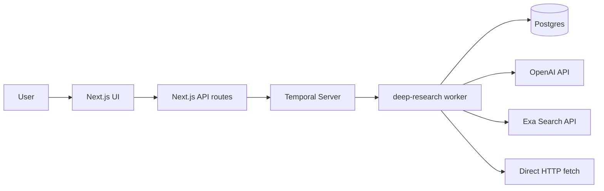
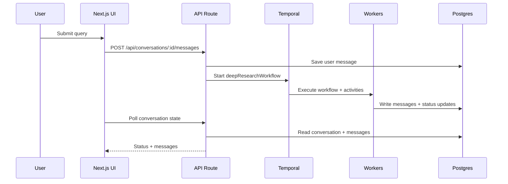
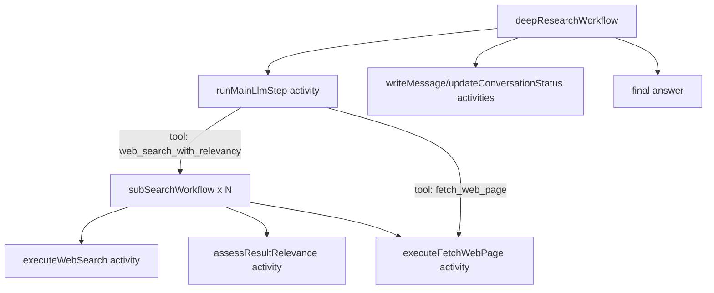

# Architecture

This document outlines the system architecture and provides rationale for the current structure, along with potential areas for improvement.

## Goals

- Temporal acts as the single orchestrator.
- Each tool call is implemented as a **separate Temporal activity**.
- Workflow code remains deterministic.
- The frontend initiates workflows and displays progress.

## System Overview

### Components

- **Next.js Web App** (`apps/web`)
  - Provides UI for conversation creation and result display.
  - Exposes API routes to start workflows and fetch state.
- **Temporal Worker** (`apps/worker`)
  - Runs a unified worker for orchestrating workflows and executing activities.
  - Uses task queue: `deep-research`.
- **Postgres + Prisma** (`packages/database`)
  - Stores conversations and messages.
- **External Services**
  - OpenAI (for LLM and relevance scoring)
  - Exa (web search)
  - Direct web page fetch

### High-Level Flow

1. A user submits a query.
2. The API stores the message and starts a Temporal workflow.
3. The workflow communicates with tools (activities) and persists progress to the database.
4. The UI polls for updates and renders new messages as available.

## Diagrams

### Component Diagram

**Note:** The worker executes all activities (DB, OpenAI, Exa, web fetch) via a single task queue to simplify configuration and maximize reliability.

### Request Sequence

### Workflow Detail

## Workflow and Activity Design

### Parent Workflow: `deepResearchWorkflow`

Location: `apps/worker/src/workflows/deepResearchWorkflow.ts`

Summary:

- Sets status to `processing` and creates a loader message.
- Builds message history from prior conversation data.
- Executes up to eight iterations of the main LLM step.
- For each tool call:
  - Stores a **tool_use** message in the database.
  - Executes the tool as a separate activity.
  - Stores a **tool_result** message.
  - Passes tool result back as context for subsequent processing.
- On completion, writes the final response and marks conversation as `completed`.

### Child Workflow: `subSearchWorkflow`

Location: `apps/worker/src/workflows/subSearchWorkflow.ts`

Purpose: Used to process sub-queries in parallel.

Steps:

1. Call `executeWebSearch` (Exa search).
2. For each result, call `assessResultRelevance` (OpenAI).
3. For each relevant URL, call `executeFetchWebPage` (HTTP fetch).

### Activities (Tools)

Each tool is implemented as a standalone Temporal activity:

- `executeWebSearch`: calls Exa API (or uses mock data)
- `assessResultRelevance`: calls LLM for scoring
- `executeFetchWebPage`: performs HTTP fetch and cleans up HTML
- `runMainLlmStep`: executes LLM logic and tool selection
- Database helpers:
  - `writeMessage`
  - `updateConversationStatus`
  - `getNextMessageIndex`
  - `getConversationTextHistory`

## Timeouts and Retries

Configured in `apps/worker/src/workflows/activityProxies.ts`:

- **Database activities** (writeMessage, updateConversationStatus, etc.):
  - `startToCloseTimeout: 1 minute`
  - `maximumAttempts: 3`
  - `initialInterval: 1 second`
  - `backoffCoefficient: 2`
- **LLM activities** (runMainLlmStep, assessResultRelevance):
  - `startToCloseTimeout: 5 minutes`
  - `maximumAttempts: 3`
  - `initialInterval: 2 seconds`
  - `backoffCoefficient: 2`
- **Web activities** (executeWebSearch, executeFetchWebPage):
  - `startToCloseTimeout: 3 minutes`
  - `maximumAttempts: 2`
  - `initialInterval: 1 second`
  - `backoffCoefficient: 2`

Retries and timeouts are tuned for each group of activities (DB, LLM, Web), ensuring failures are isolated and recovery behavior is intentional.

## Data Model and Message Format

Data is stored in Postgres using Prisma models:

- `Conversation`: `id`, `status`, `workflowId`, `loaderText`, timestamps
- `Message`: `conversationId`, `sender`, `index`, `content` (JSON)

The `content` field is a list of blocks:

- `text`: assistant or user text
- `tool_use`: tool name and input parameters
- `tool_result`: tool output or error details

This approach enables the UI to render each step without requiring extra tables.

## Determinism Boundaries

Workflow code maintains determinism by:

- Using only Temporal APIs (`executeChild`, proxied activities).
- Avoiding use of random numbers or clocks within workflows.
- Confined side effects (LLM calls, web fetches, DB writes) to activities.

## Failure Handling

- On tool failure, a **tool_result** with `is_error: true` is recorded.
- For web search:
  - If fewer than 50% of sub-searches succeed, the tool returns a structured error.
  - Successful results are aggregated and filtered for relevance.
- Any unhandled workflow error sets the conversation status to `failed`.

## Task Queues

- **Single task queue:** `deep-research`
- The worker is registered on this queue and hosts:
  - All workflows (`deepResearchWorkflow`, `subSearchWorkflow`)
  - All activities (DB, LLM, web search, web fetch)
- The API and child workflows both use `deep-research` as their queue.

A single queue ensures all activities are accessible without cross-worker issues. For rate limiting or resource isolation, adjust `maxConcurrentActivityTaskExecutions` or use activity-level limits.

## Tradeoffs

- **Direct DB writes from worker:** Simplifies persistence, but increases coupling.
- **Polling in UI:** Simple, but less efficient compared to push updates.
- **Single workflow loop:** Centralizes logic, but can result in longer workflow histories.

## Production Considerations

When running in production, consider:

- Splitting workers based on resource demands for:
  - Per-service rate limits (e.g., Exa: 5 QPS, OpenAI: 500 RPM)
  - Independent scaling of activity types
  - Resource isolation for heavier or latency-sensitive activities
  - Requires explicit task queue assignment in activity proxies
- Adding authentication, rate limiting, and input validation.
- Implementing push-based UI updates (Server-Sent Events or WebSockets) to replace polling.
- Adding structured tracing and activity-level metrics.
- Caching web search and fetch results.
- Integrating monitoring and alerting for worker and activity health.
